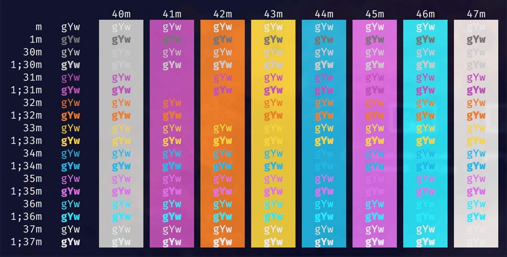

  

# Cold Snack for iTerm

A crisp, refreshing, original color theme for iTerm 2.

There's nothing better in life than a tall, refreshing, cold snack for your tastebuds and your eyeballs. Reminiscent of the Unofficial Official Beer of Montana, the Cold Snack theme will soothe and satiate your mind
as you nimbly execute your bidding upon your system.

- Launch iTerm 2. Get the latest version at [iterm2.com](https://www.iterm2.com/version3.html)
- Type CMD+i
- Navigate to "Colors" tab
- Click on the "Color Presets" menu
- Click on "Import…"
- Select the `cold-snack.itermcolors` file
- Click on the "Color Presets" menu again and select "cold-snack"